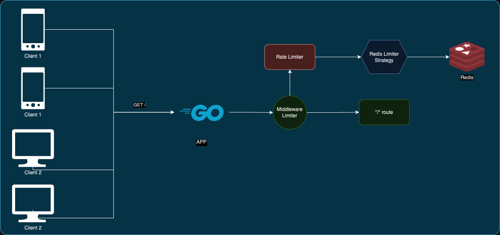

# Go Expert Challenge - Implementação de Rate Limiter

Este projeto aborda a implementação de um rate limiter utilizando a linguagem Go para controlar o fluxo de requisições em um serviço web. Ele limita a quantidade de requisições realizadas pelos clientes com base no endereço IP ou token `API_KEY`, de acordo com intervalos de tempo definidos.

## Arquitetura do Sistema



### Componentes Principais

A estrutura da aplicação é composta por:

1. **Servidor Web**: Responsável por receber e responder às requisições HTTP.
2. **Middleware de Rate Limiter**: Implementado em [ratelimiter.go](internal/infra/web/middlewares/ratelimiter.go), este componente intercepta todas as requisições, aplicando as regras de limitação com base no objeto `RateLimiter`.
3. **Rate Limiter**: O núcleo do controle de requisições, descrito em [limiter.go](internal/pkg/ratelimiter/limiter.go), que executa a lógica de rate limiting e invoca a estratégia de armazenamento configurada.
4. **Redis como Armazenamento**: Utilizado para armazenar as contagens de requisições, garantindo uma rápida recuperação de dados e suportando escalabilidade.

### Configuração via Variáveis de Ambiente

Os parâmetros de controle do rate limiter são definidos no arquivo `.env`, com as seguintes variáveis:

- `RATE_LIMITER_IP_MAX_REQUESTS`: Número máximo de requisições permitidas por IP.
- `RATE_LIMITER_TOKEN_MAX_REQUESTS`: Número máximo de requisições permitidas por token.
- `RATE_LIMITER_TIME_WINDOW_MILISECONDS`: Duração da janela de tempo em milissegundos.

Exemplo de configuração:
```sh
RATE_LIMITER_IP_MAX_REQUESTS=10
RATE_LIMITER_TOKEN_MAX_REQUESTS=100
RATE_LIMITER_TIME_WINDOW_MILISECONDS=300000  # 5 minutos
```

As variáveis de ambiente são lidas pelo [gerenciador de dependências](internal/pkg/dependencyinjector/injector.go) no início da aplicação, garantindo flexibilidade na configuração.

## Funcionamento do Rate Limiter

Quando o limite de requisições é excedido, a resposta retorna um status `429 Too Many Requests`, acompanhado de um corpo JSON:
```json
{"message":"you have reached the maximum number of requests or actions allowed within a certain time frame"}
```
Além disso, os cabeçalhos de resposta incluem:
- `X-Ratelimit-Limit`: Limite máximo de requisições.
- `X-Ratelimit-Remaining`: Quantidade de requisições restantes.
- `X-Ratelimit-Reset`: Tempo restante para o reset do limite.

## Estratégias de Armazenamento

### Interface de Limitação

A arquitetura do projeto permite flexibilidade para trocar o mecanismo de armazenamento através da interface `LimiterStrategyInterface`. Atualmente, o Redis é a implementação padrão, mas outras opções podem ser integradas, como bancos de dados relacionais ou armazenamento em memória, apenas injetando a nova estratégia.

## Testes e Benchmarks

### Ferramentas Utilizadas

O projeto foi testado usando o [Grafana k6](https://k6.io/) para realizar tanto testes de carga quanto de estresse. Os resultados e gráficos de desempenho estão documentados em [BENCHMARKS.md](./BENCHMARKS.md).

## Como Executar o Projeto

**Pré-requisitos**: Docker e Docker Compose devem estar instalados em seu ambiente.

1. **Configuração**: Crie um arquivo `.env` na raiz do projeto usando `.env.example` como modelo e ajuste as variáveis conforme necessário.
2. **Iniciar a aplicação**: Use o comando abaixo para iniciar o Redis e a aplicação:
   ```sh
   docker compose up redis api
   ```

## Exemplos de Requisições

### Sucesso na Checagem por IP
```sh
➜  curl -vvv http://localhost:8080
*   Trying [::1]:8080...
* Connected to localhost (::1) port 8080
> GET / HTTP/1.1
> Host: localhost:8080
> User-Agent: curl/8.4.0
> Accept: */*
> 
< HTTP/1.1 200 OK
< Accept: application/json
< Content-Type: application/json
< X-Ratelimit-Limit: 10
< X-Ratelimit-Remaining: 2
< X-Ratelimit-Reset: 1728329374
< Date: Mon, 07 Oct 2024 19:29:26 GMT
< Content-Length: 27
< 
{"message":"Hello World!"}
* Connection #0 to host localhost left intact
```

### Sucesso na Checagem por Token
```sh
➜  curl -H 'API_KEY: api-key-123' -vvv http://localhost:8080
*   Trying [::1]:8080...
* Connected to localhost (::1) port 8080
> GET / HTTP/1.1
> Host: localhost:8080
> User-Agent: curl/8.4.0
> Accept: */*
> API_KEY: api-key-123
> 
< HTTP/1.1 200 OK
< Accept: application/json
< Content-Type: application/json
< X-Ratelimit-Limit: 100
< X-Ratelimit-Remaining: 99
< X-Ratelimit-Reset: 1728329485
< Date: Mon, 07 Oct 2024 19:31:15 GMT
< Content-Length: 27
< 
{"message":"Hello World!"}
* Connection #0 to host localhost left intact
```

### Limite Excedido na Checagem por IP
```sh
➜  curl -vvv http://localhost:8080
*   Trying [::1]:8080...
* Connected to localhost (::1) port 8080
> GET / HTTP/1.1
> Host: localhost:8080
> User-Agent: curl/8.4.0
> Accept: */*
> 
< HTTP/1.1 429 Too Many Requests
< Accept: application/json
< Content-Type: application/json
< X-Ratelimit-Limit: 10
< X-Ratelimit-Remaining: 0
< X-Ratelimit-Reset: 1728329374
< Date: Mon, 07 Oct 2024 19:29:28 GMT
< Content-Length: 109
< 
{"message":"you have reached the maximum number of requests or actions allowed within a certain time frame"}
* Connection #0 to host localhost left intact
```

### Limite Excedido na Checagem por Token
```sh
curl -H 'API_KEY: api-key-123' -vvv http://localhost:8080
*   Trying [::1]:8080...
* Connected to localhost (::1) port 8080
> GET / HTTP/1.1
> Host: localhost:8080
> User-Agent: curl/8.4.0
> Accept: */*
> API_KEY: api-key-123
> 
< HTTP/1.1 429 Too Many Requests
< Accept: application/json
< Content-Type: application/json
< X-Ratelimit-Limit: 5
< X-Ratelimit-Remaining: 0
< X-Ratelimit-Reset: 1728329541
< Date: Mon, 07 Oct 2024 19:32:13 GMT
< Content-Length: 109
< 
{"message":"you have reached the maximum number of requests or actions allowed within a certain time frame"}
* Connection #0 to host localhost left intact
```

## Testes Automatizados

### Testes Unitários

Para rodar os testes unitários do projeto e verificar a cobertura, execute:
```sh
make test
```

### Testes de Estresse

Para executar os testes de estresse com o k6:
1. Certifique-se de que a aplicação e o Redis estejam em execução.
2. Execute:
   ```sh
   make test_k6_smoke
   ```
   para um teste rápido (_smoke test_) ou:
   ```sh
   make test_k6_stress
   ```
   para um teste prolongado (_stress test_).

Os resultados dos testes de carga estão disponíveis em `./scripts/k6/smoke` e `./scripts/k6/stress`, incluindo relatórios em formato de texto e HTML.

## Considerações Finais

O sistema foi projetado para ser modular e extensível, facilitando a adição de novos recursos e estratégias de armazenamento sem grandes alterações na lógica de negócio. A utilização do Redis garante uma solução robusta e escalável para controle de tráfego em aplicações de alta demanda.